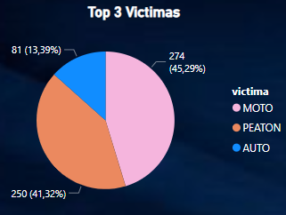
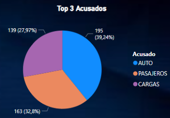
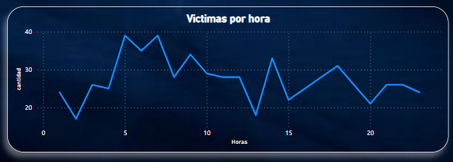

# 
*SINIESTROS VIALES*

# 
*Análisis de accidentes de tránsito en Ciudad Autónoma de Buenos Aires*

---
# Descripcion y Objetivo

En este proyecto nos desempeñamos como *`Data Analyst`*, llevando a cabo un análisis exhaustivo de los accidentes ocurridos en la Ciudad de Buenos Aires, teniendo en cuenta que en Argentina cada año mueren cerca de 4.000 personas en siniestros viales.

Nuestro ***objetivo*** principal es generar información que permita a las autoridades locales tomar medidas efectivas para reducir la cantidad de víctimas fatales en los accidentes de tráfico. A través de nuestro trabajo, buscamos proporcionar datos significativos tanto a las autoridades gubernamentales como al Observatorio de Movilidad y Seguridad Vial (OMSV), contribuyendo así a mejorar la seguridad vial en nuestra comunidad. 

***Además***, proporcionamos un análisis completo de los accidentes ocurridos entre los años 2016 y 2021, permitiendo distinguir entre aquellos de gravedad leve y grave.

---
# Estructura del repositorio

``Carpetas:``

[Data](Data):

Esta carpeta incluye todos los dataset usados en el proyecto, a continuacion detallo brevemente cada uno de ellos: 

- **homicidios.xlsx** y **lesiones.xlsx**: Datasets originales brindados para analisis principal
- **homicidios_df.csv**, **homicidios_fatal.csv** y **lesiones_df.csv**: Datasets extraídos y estructurados para análisis determinados
- **siniestros.csv**: Incluye todos los datos de homicidios y lesiones xlsx, tratados.
- **kpi3.csv**, **kpi3.csv** y **kpi3.csv**: Datasets resumidos para calculo de indicadores de objetivos.

[images](images):

Esta carpeta incluye imagenes usadas en todo el proyecto 

`Notebooks y Etapas:`

- [ETL](ETL.ipynb): Primer proceso llevado a cabo durante el proyecto, extrajimos, tratamos y luego cargamos los datos en archivos diferentes.
- [EDA](EDA.ipynb): Segundo proceso llevado a cabo durante el proyecto, en este exploramos y analizamos los datos creando relaciones entre variables y extrayendo conclusiones. 
- [Kpi's](Kpi's.ipynb): Tercer proceso. En este llevamos a cabo el calculo de métricas necesarias para el calculo de los kpi.

`Dashobard:`

En [DashboardSiniestros](DashboardSiniestros.pbix) Se presenta el análisis principal de forma interactiva para los usuarios, el cual incluye conclusiones relevantes y recomendaciones para la reducción de siniestros fatales. Este análisis fue desarrollado utilizando Power BI y se encuentra disponible en este repositorio en formato .pbix y OnLine en [NCC-SiniestrosViales](https://www.novypro.com/project/proyecto-siniestros-viales-ncc-power-bi).

---

# Hallazgos e Insights

A lo largo del desarrollo del proyecto y análisis de los datos, se destacaron algunos hallazgos importantes:

- Del total de casos de accidentes, entre graves, leve, lesionado y fatal, se estima que entre los años 2016 a 2021 el **1.73%** de los accidentes resultaron en **victimas fatales**
- El **98,27%** fueron victimas leves, lesionados o graves. 
- Los **motociclistas y peatones** son las principales **victimas** en los accidentes de transito, mientras que, los principales **acusados** son los **autos y pasajeros**
- Los **horarios** en los que mas aumenta la tasa de **fatalidad** en los accidentes de transito es entre las **5:00 y 8:00hs**.

  
  

  

Estos son solo algunos de los mas importantes hallazgos a lo largo del análisis. Podrás encontrar mayor información y mas detallada en el reporte escrito agregado en un libro aparte: [REPORTE](REPORTE.md)

---
# Paginas consultadas:

- [buenosaires.gob.ar](https://buenosaires.gob.ar/sindicatura/universo-de-control/comunas-15)
- [INDEC](https://www.indec.gob.ar/indec/web/Nivel4-Tema-2-41-165)
- [COORDENADAS-GPS](https://www.coordenadas-gps.com/)
- [PowerQuerydocumentation](https://learn.microsoft.com/en-us/power-query/)
- [DataAnalysisExpressionsReference](https://learn.microsoft.com/en-us/dax/)

---

# Tecnologías y herramientas aplicadas:

- Jupyter Notebook
- Python
- Power BI
- NovyPro
- Excel

# Librerias mas utilizadas: 

- Pandas - Python
- Matplotlib - Python 
- Seaborn - Python
- Numpy - Python
- Wordcloud - Python

---

# Enlaces de Autor:
- [ReporteEscrito](REPORTE.md)
- [DashboardInteractivo](https://www.novypro.com/project/proyecto-siniestros-viales-ncc-power-bi)
- [LinkedIn](https://www.linkedin.com/in/catalina-castelblanco/)

---

Agradezco tu visita e interes en este segundo proyecto. Te invito a compartir opiniones o sugerencias en caso que las tengas a traves de alguno de mis medios de contacto mas arriba señalados o por mail: 
nadyacatalina99@gmail.com